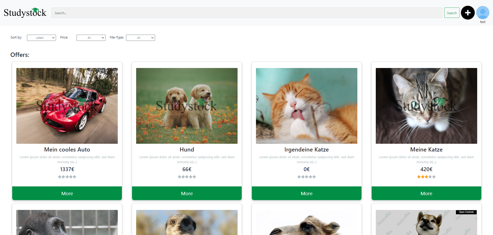
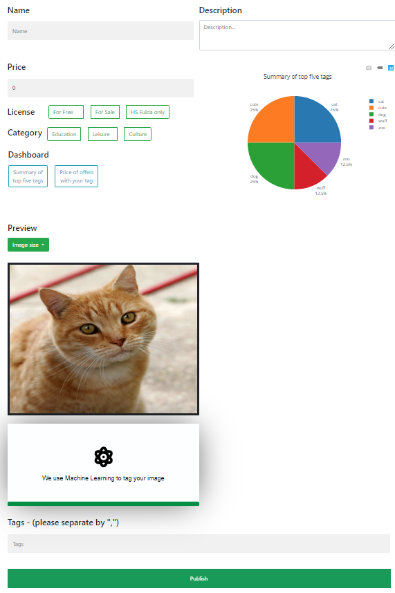
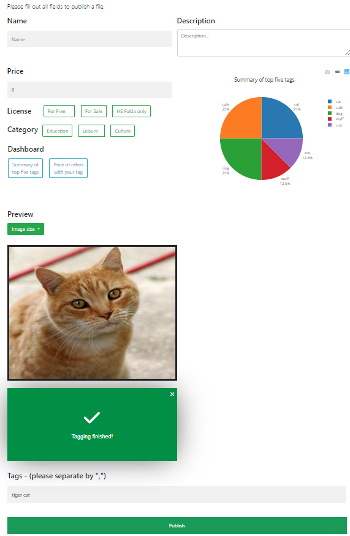

https://github.com/JAdelhelm/Studystock-Website-with-Vue.js-and-Node.js/assets/83546217/a862ae86-c6a7-4cf6-ba4d-78be4da8d4bd




# Instructions
1. `git clone` the project
2. Navigate to the repository
3. Execute `npm install` (In the root directory)
4. Execute `npm install` in the folder `my-app`

## Database
1. Download MySQL: https://dev.mysql.com/downloads/installer/
   - Windows (x86, 32-bit), MSI Installer (435.7MB)
   - Choose the custom option
   - Install MySQL Server and Workbench - Server 8.x and Workbench 8.x
     - password: password
   - Start Workbench and enter: `ALTER USER 'root'@'localhost' IDENTIFIED WITH mysql_native_password BY 'password';`

2. Test the connection by navigating to the folder `nodejsmysql`
   - Execute `node db_connection.js` and then cancel
3. Create the database with `node create_db.js`
4. Under MySQL Workbench, the database (localhost) should now be available.
5. To execute queries on the database, execute `USE teamprojekt;` at the beginning of the query.
6. Then create a table with `node create_table.js`
7. View the different tables in MySQL Workbench with SHOW TABLES;.
8. View the respective table with SELECT * FROM tablename;
9. Navigate back to the root directory and execute `npm run dev`.
10. Open a new bash and navigate to my-app and execute `NODE_OPTIONS=--openssl-legacy-provider npm run serve`.

11. Open localhost and register. For example, use the following user:
```json
{
  "username": "test",
  "email": "test@informatik.hs-fulda.de",
  "password": "123456789",
  "password_repeat": "123456789"
}
```
12. Uploaded media can be unlocked by the admin with (create_tables.js - line 106):
```json
{
  "username": "admin",
  "password": "admin12345",
}
```
## Backend
1. Navigate to the root directory and execute `npm run dev`
2. Usually on port: 8080
## Frontend
1. Navigate to the folder `my-app` and execute `npm run serve`
- If there are errors with ``npm run serve``, execute: ``NODE_OPTIONS=--openssl-legacy-provider npm run serve``
2. Usually on port: 80


### Accessing the Database Server
1. Open MySQL Workbench and write a new connection
   1. Connection Name: "any"
   2. Hostname: teamprojekt-mysql.mysql.database.azure.com
   3. User: teamprojektadmin
   4. Password: Sommersemester!
   5. Test Connection
   6. If the connection is established, then click "OK"

#  Anleitung
1.  ``git clone``
    -  Git Bash öffnen und zum Ordner navigieren
2. In das Repositorium navigieren
3. ``npm install`` ausführen (Im Oberverzeichnis)
4. ``npm install`` ausführen im Ordner ``my-app``

## Datenbank
1. MySQL downloaden: https://dev.mysql.com/downloads/installer/
    - Windows (x86, 32-bit), MSI Installer (435.7MB)
    - Option custom wählen
    - Installieren von MySQL Server und Workbench - Server 8.x und Workbench 8.x
      <!-- - username: root -->
      - password: password
   - Starten der Workbench und folgendes eingeben: `` ALTER USER 'root'@'localhost' IDENTIFIED WITH mysql_native_password BY 'password'; ``

2. Verbindung testen mit navigieren zum Ordner ``nodejsmysql``
   - ``node db_connection.js`` ausführen und anschließend abbrechen
3. Datenbank erstellen mit ``node create_db.js``
4. Unter MySQL Workbench sollte nun die Datenbank (localhost) vorhanden sein.
5. Um Abfragen auf der Datenbank auszuführen, führe ``USE teamprojekt;`` am Anfang der Query aus.
6. Erzeuge anschließend eine Tabelle mit ``node create_table.js``
7. Zeige dir in MySQL Workbench die verschiedenen Tabellen mit SHOW TABLES; an.
8. Zeige die jeweilige Tabelle mit SELECT * FROM tabellenname;
9. Navigiere ich das root Verzeichnis und führe ``npm run dev`` aus.
10. Erstelle eine neue bash und navigiere zu my-app und führe ``NODE_OPTIONS=--openssl-legacy-provider npm run serve`` aus.

11. Öffne localhost und registriere dich. Nutze bspw. den folgenden Nutzer:

```json
{
  "username": "test",
  "email": "test@informatik.hs-fulda.de",
  "password": "123456789",
  "password_repeat": "123456789"
}
```
12. Hochgeladene Medien können vom admin feigeschaltet werden, mit (create_tables.js - Zeile 106):
{
  "username": "admin",
  "password": "admin12345",
}
## Backend
1. In das Oberverzeichnis navigieren und ``npm run dev`` ausführen
2. Üblicherweise auf Port: 8080
## Frontend
1. In den Ordner ``my-app`` navigieren und ``npm run serve`` ausführen
- Falls Fehler in``npm run serve``, führe: ``NODE_OPTIONS=--openssl-legacy-provider npm run serve`` aus
2. Üblicherweise auf Port: 80


### Zugriff auf den Datenbank-Server
1. MySQL Workbench öffnen und neue Verbindung reinschreiben
   1. Connection Name: "beliebig"
   2. Hostname: teamprojekt-mysql.mysql.database.azure.com
   3. User: teamprojektadmin
   4. Password: Sommersemester!
   5. Test Connection
   6. Wenn Verbindung steht, dann "OK"

</br>

Problembehandlung bei folgendem Fehler: </br> ``MySQL 8.0 - Client does not support authentication protocol requested by server; consider upgrading MySQL client``
> https://stackoverflow.com/questions/50093144/mysql-8-0-client-does-not-support-authentication-protocol-requested-by-server </br> </br>
> MySQL Workbench folgende Query ausführen: </br>
> `` ALTER USER 'root'@'localhost' IDENTIFIED WITH mysql_native_password BY 'password'; ``

### Run npm
> "npm run dev" in root </br>
> "npm run serve" in my-app </br>

### More information about the use of git
- Default language for git commits is **english**
- Please try to do **1 commit for 1 change (Bug fix, one more feature etc.)**
- Add files to the git repository with ``git add``
- Then commit with ``git commit -m "Your Text"``
- Push to repository with ``git push``
- Check logs of commits with ``git log --oneline`` for more detailed information only ``git log``
- Check the changes between two commits with ``git diff <hash1> <hash2>`` 
- Check changes of a single with ``git diff <hash1> <hash2> -- Dashboard.vue`` 
  - ``<hash2>`` is the older commit in the commit history
<!-- - Remove changes from staging area with ``git reset`` use ``(--)`` for a single file, ``git reset --hard`` for all files
- Reset working directory to an earlier git repo version with ``git checkout <hash>``
- ``HEAD`` is the just checked out commit -->

### ``Git-Workflow``


## A major contribution from my side was the integration of automated tagging with machine learning



# Created by:
- Jörg Adelhelm
- Maximilian Leitschuh
- Julian Schuster
- Niklas Kümmel
---
